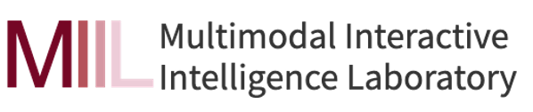
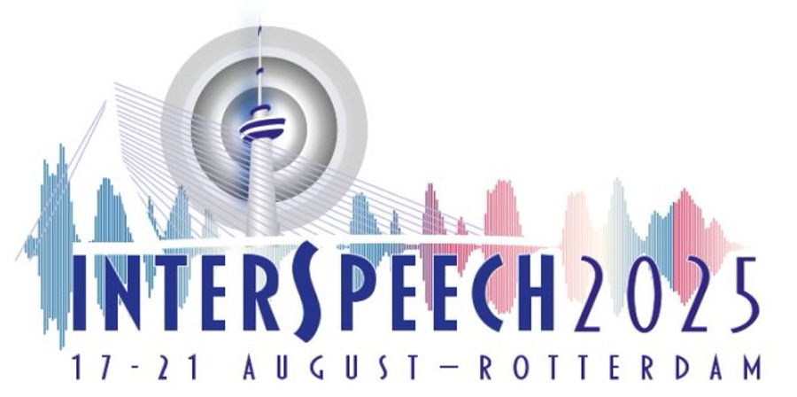

<div style="display: flex; justify-content: center; align-items: center; gap: 100px;">
  
  
  
</div>


# DGMO: Training-Free Audio Source Separation through Diffusion-Guided Mask Optimization (Interspeech 2025)

[[Paper]](https://arxiv.org/abs/2506.02858) [[Project Page]](https://wltschmrz.github.io/DGMO/)

by [Geonyoung Lee](https://wltschmrz.github.io/)\*, [Geonhee Han](https://chaksseu.github.io/)\*, [Paul Hongsuck Seo](https://phseo.github.io/)  
\*Equal contribution

This is the official repository for our Interspeech 2025 paper:  
**DGMO: Training-Free Audio Source Separation through Diffusion-Guided Mask Optimization**.

We propose a novel *training-free* framework that enables **zero-shot language-queried audio source separation** by repurposing pretrained text-to-audio diffusion models. DGMO refines magnitude spectrogram masks at test-time via guidance from diffusion-generated references.

---

## Overview


DGMO consists of two key modules:

- **Reference Generation**: Uses DDIM inversion to generate query-conditioned audio references with pretrained diffusion models.
- **Mask Optimization**: Learns a spectrogram mask aligned to the reference, enabling faithful extraction of the target sound from the input mixture.

Unlike traditional LASS approaches, DGMO requires no training and generalizes across datasets with only test-time optimization.

---

## Installation

We recommend using `conda` to create a clean environment:

```bash
conda create -n dgmo python=3.10 -y
conda activate dgmo
pip install -r requirements.txt
```

Make sure you have `ffmpeg` installed if you work with audio files:

```bash
conda install -c conda-forge ffmpeg
```


## Inference

You can perform source separation using DGMO with a simple shell script.

### Step 1: Set Up `inference.sh`

Modify the following variables in the script:

```bash
# inference.sh

# Input mixture path
MIX_PATH="./data/samples/dog_barking_and_cat_meowing.wav"

# Text queries (e.g., sources you want to extract)
TEXTS=("dog barking" "cat meowing")
```

Each text query corresponds to a target sound to be separated.

---

### Step 2: Run Inference

Run the script as follows:

```bash
bash inference.sh
```

This will:

- Run DGMO inference for each query  
- Save the separated audio as `.wav` files  
- Create a timestamped directory for organized output (e.g., `./results/run_20250607_170502/`)


## Acknowledgement

Our implementation builds on several open-source projects including [AudioLDM](https://github.com/haoheliu/AudioLDM), [Auffusion](https://github.com/happylittlecat2333/Auffusion), and [Peekaboo](https://github.com/RyannDaGreat/Peekaboo). We sincerely thank the authors for their contributions.


---

## Citation

If you find our work useful in your research, please consider citing:

```bibtex
※ This BibTeX entry is a placeholder. Please refer to the official Interspeech 2025 proceedings for the final citation.
@inproceedings{lee2025dgmo,
  title={DGMO: Training-Free Audio Source Separation through Diffusion-Guided Mask Optimization},
  author={Geonyoung Lee and Geonhee Han and Paul Hongsuck Seo},
  booktitle={Proceedings of the Annual Conference of the International Speech Communication Association (INTERSPEECH)},
  year={2025}
}


